# Clockin' Web Application

Aplikacja służąca do rejestrowania i zarządzania czasem pracy oraz urlopami pracowników.
Zawiera strony z rejestracją/logowaniem, panel do zarządzania sesjami pracy, panel urlopowy, a dla managera dodatkowo panel do podglądu pracowników i zatwierdzania wniosków.

## Technologie

- HTML, CSS (CSS media queries)
- PHP
- JavaScript (w tym FetchAPI)
- PostgreSQL
- Docker

## Struktura projektu
- login.php:
    - Formularz logowania (email, hasło), link do rejestracji.
    - Po poprawnym logowaniu kieruje do home.php.
- register.php
    - Formularz rejestracji (imię, nazwisko, email, hasło).
    - Po poprawnym utworzeniu konta przekierowuje do logowania.
- index.php (strona główna użytkownika)
    - Wyświetlanie czasu pracy (statystyki daily/weekly/monthly/yearly).
    - Przycisk START/STOP WORK – zarządzanie sesją pracy (WorkSessionService).
    - Dla managera (role=1) w menu jest dodatkowa zakładka EMPLOYEES.
- leave.php
    - Wyświetlanie i składanie urlopów (status: pending, approved, rejected).
    - Możliwość otwarcia szczegółów urlopu w modalu.
    - Przycisk NEW LEAVE (formularz).
- employee.php (panel menagera)
    - Lista wszystkich pracowników (w tym samego menagera na górze).
    - Przy każdym pracowniku wyświetlona jest liczba oczekujących urlopów.
    - Kliknięcie w pracownika przenosi do employee_details.php.
- employee_data.php (panel menagera)
    - Szczegóły wybranego pracownika (imię, nazwisko, rola, email).
    - Lista wszystkich jego urlopów.
    - Kliknięcie w urlop -> modal do zatwierdzania/odrzucania + manager_info.
- settings.php
    - Wyświetlanie aktualnego profilu (imię, nazwisko, email).
    - Zmiana e-maila, zmiana hasła, usunięcia konta.

- Kontrolery/
    - LoginController.php, RegisterController.php - obsługa formularzy logowania, rejestracji.
    - WorkController.php - obsługa rozpoczęcia, zakończenia pracy.
    - StatsController.php - zwraca JSON ze statystykami pracy (wywoływane fetch() w index.php)
    - SettingsController.php - obsługa zmiany emailu, hasła.
    - LeaveController.php - obsługa tworzenia urlopu.
    - LeaveDecisionController.php - obsługa zmiany statusu urlopu.
    - DeleteAccountController.php - obsługa usuwania konta i powiązanych danych (tranzakcja). 
- Serwisy/
    - AuthorizationService.php - rejestracja, logowanie (w tym hashowanie haseł przy pomocy password_hash()).
    - LeaveService.php - tworzenie, wyświetlanie urlopów.
    - WorkSessionService - logika start/stop sesji pracy, obliczanie czasu.
- Repozytoria/
    - UserRepository.php, WorkSessionRepository.php, LeaveRepository.php, LeaveTypeRepository.php, EmployeeRepository.php, EmployeeDetailsRepository.php - zapytania SQL do bazy.
- Modele/
    - User.php - model użytkownika.
- BazaDanych/
    - Database.php - klasa łącząca z bazą PostgreSQL przez PDO.

## Baza Danych
W projekcie została użyta baza PostgreSQL. 

Tabele:
- users, work_sessions, leaves, roles, working_status, leave_status, leave_type 

Widoki:
- vw_user_info, vw_employees 

Wyzwalacz:
- trigger_update_manager_confirmation_date

Funkcje:
- get_current_session_work_time, get_daily_work_time, get_weekly_work_time, get_monthly_work_time, get_yearly_work_time

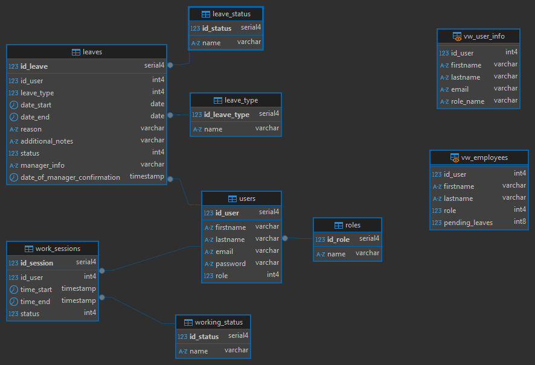


## Uruchomienie projektu
### 1. Klonujemy repozytorium
```bash
git clone https://github.com/akknapik/wdpai.git
```
### 2. Uruchamiamy kontener dockera
```bash
docker-compose up --build
```
### 3. Wpisujemy w przeglądarkę:
```bash
localhost:8080
```

## Instrukcja użycia aplikacji
### 1. Otwórz stronę localhost:8080
### 2. Zaloguj się testowymi danymi (/login.php)

(Konto menagera: email: dkowalczyk@gmail.com, hasło: dkowalczyk,

konto pracownika: email: mgrabowska@gmail.com, hasło: mgrabowska)

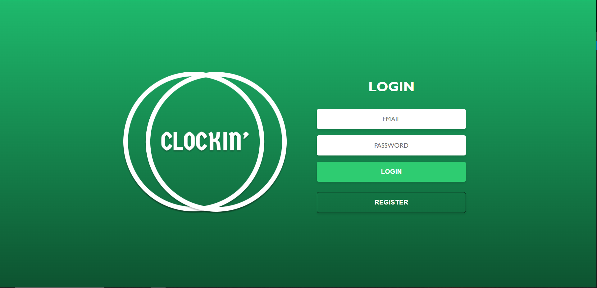

### 3. lub Zarejestruj się (/register.php)

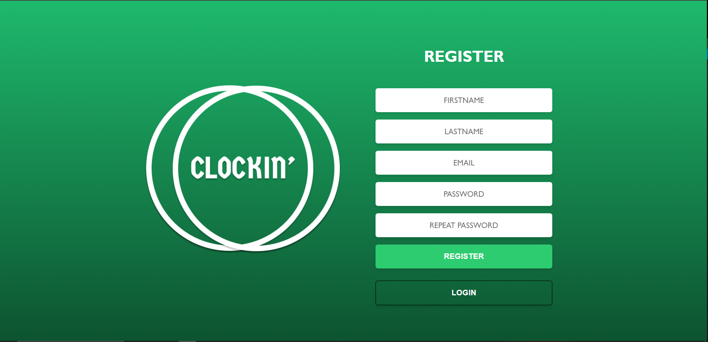

### 4. HOME (index.php)
- na tej stronie możesz zobaczyć swoje statystki dotyczące czasu pracy lub rozpocząć (Start work) / zakończyć (Stop work) sesje pracy.
 
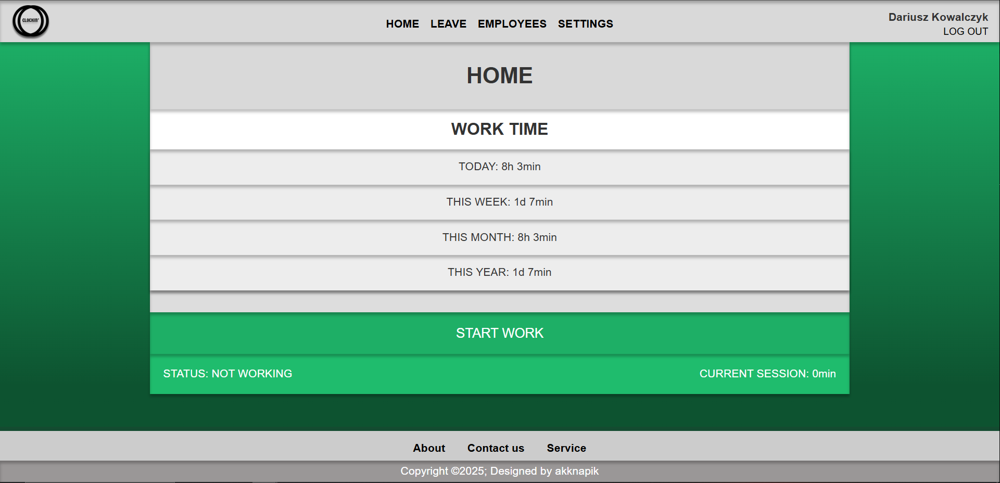
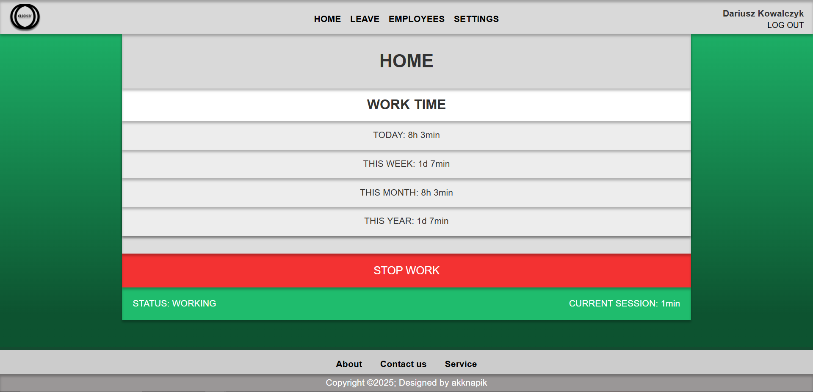

### 5. LEAVE (leave.php)
- na tej stronie możesz przeglądać swoje urlopy lub składać nowe wnioski.
 
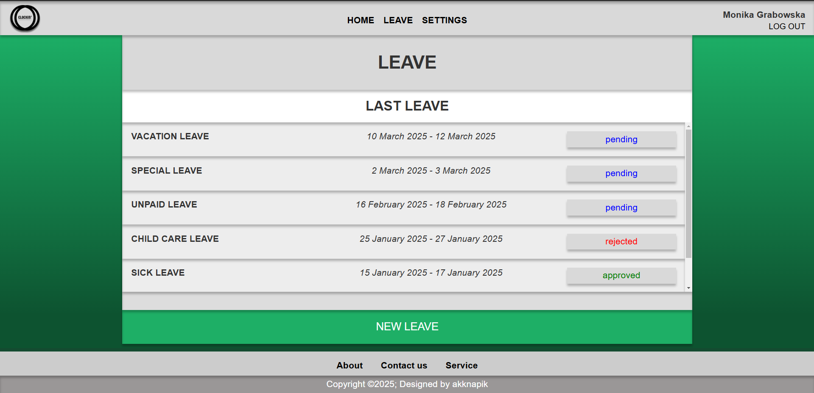

- po kliknięciu na dany urlop, wyświetla się modal z dokładnymi informacjami.
 
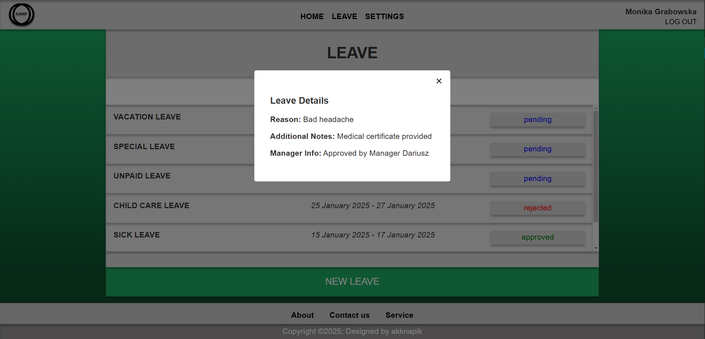

- po kliknięciu NEW LEAVE otwiera się formularz (new_leave.php), gdzie możesz wpisać dane odnośnie urlopu, a następnie wysłać wniosek. Wniosek będzie miał status "pending" do momentu, aż menager nie zaakceptuje ("approved") lub odrzuci ("rejected") wniosku.

- 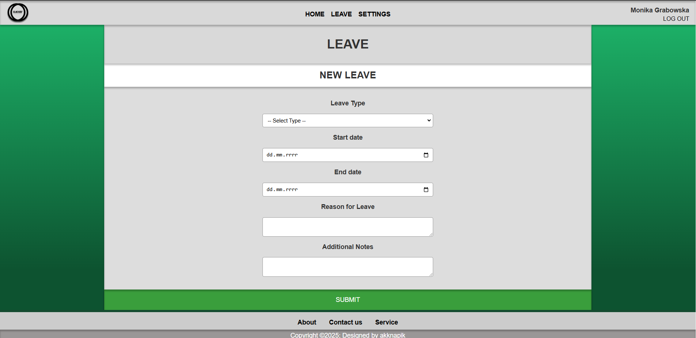

### 6. EMPLOYEES (employees.php) - tylko dla menagera (role = 1)
- na tej stronie znajduje się lista wszystkich pracowników, a obok nich liczba wniosków do zatwierdzenia.

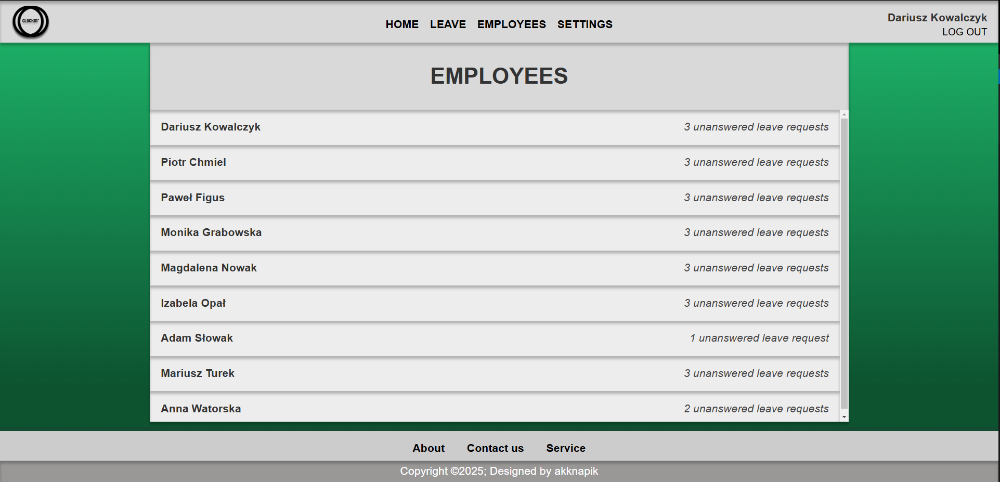

- po kliknięciu na danego pracownika, otwiera się strona (employee_details.php), na której są informacje o pracowniku oraz lista wszystkich jego urlopów, w tym urlopów do zatwierdzenia (na samej górze listy).

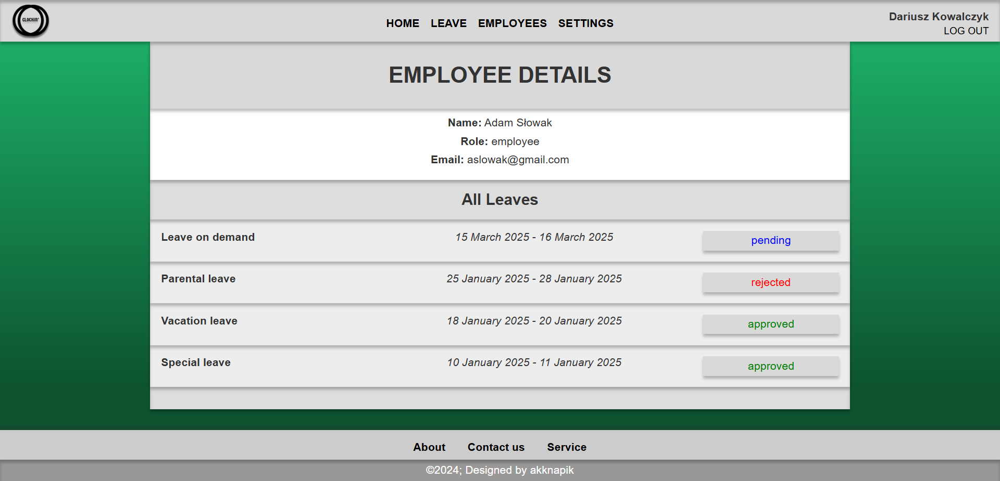

- po kliknięciu na dany urlop, otwiera się modal, na którym możemy wpisać uzasadnienie decyzji (manager_info), a także zaakceptować lub odrzucić wniosek.

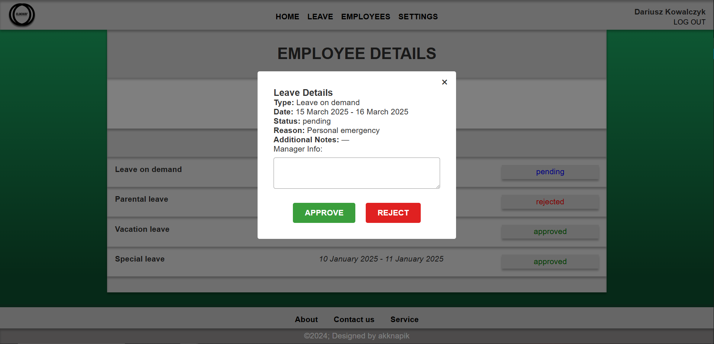

### 7. SETTINGS (settings.php)
- na tej stronie znajdują się informacje o pracowniku (imię, nazwisko, email), a także odnośniki do zmiany emailu, hasła oraz usunięcia konta.

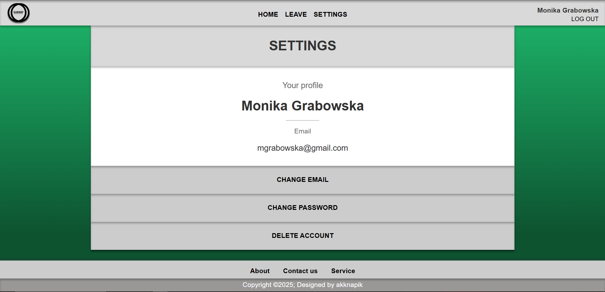

- po kliknięciu w odnośnik otwiera się formularz (change_email.php lub change_password.php), gdzie po prawidłowym wypełnieniu danych następuje zmiana emailu lub hasła.

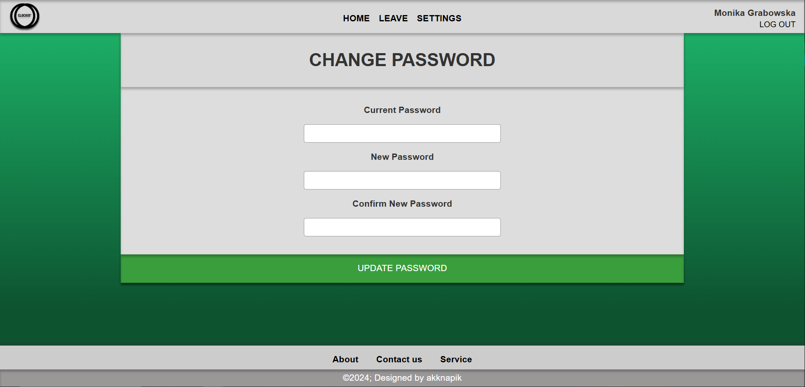
